# Device Independent Quantum Key Distribution

## Securing Communication Without Trusting Your Devices

  
    Hong Kong 2024
  

<!--
NANO BANANA PRO PROMPT:
"Anime style illustration of two characters, Alice and Bob, exchanging a glowing quantum key through a futuristic city skyline at night. Cyberpunk aesthetic with neon pink and blue colors. Studio Ghibli meets Ghost in the Shell. The key appears as a shimmering stream of photons between them."
-->

---
layout: image-right
image: /images/quantum-lock.png
---

# Why Do We Need Encryption?

<v-clicks>

- 🔒 Protect private messages
- 🏦 Secure financial transactions
- 🏥 Keep medical records safe
- 🗳️ Enable secure voting

</v-clicks>

<!--
NANO BANANA PRO PROMPT:
"Anime style digital padlock floating in cyberspace, surrounded by flowing data streams and binary code. Soft glowing blue and purple colors. Clean, minimalist Japanese illustration style."
-->

---

# The Problem with Classical Cryptography

## Today's Security

- Based on **mathematical difficulty**
- RSA: Hard to factor large numbers
- Works... for now

## The Quantum Threat

- Quantum computers can break RSA
- Shor's algorithm: Exponential speedup
- "Harvest now, decrypt later"

<!--
NANO BANANA PRO PROMPT:
"Anime illustration split in two: Left side shows a confident character with a traditional padlock, right side shows an ominous quantum computer monster breaking through. Dramatic lighting, manga panel style composition."
-->

---
layout: center
---

# Enter: Quantum Key Distribution (QKD)

🔠+ âš›ï¸ = 💪

Security based on **physics**, not math!

<!--
NANO BANANA PRO PROMPT:
"Cute anime scientist character excitedly presenting a glowing quantum particle. The particle emits soft pink and blue light. Background shows elegant quantum wave functions. Kawaii style but scientifically themed."
-->

---

# How QKD Works: The BB84 Protocol

### Alice
Prepares photons in random bases

### Quantum Channel
Photons travel through fiber/air

### Bob
Measures in random bases

| Alice's Basis | Alice's Bit | Bob's Basis | Bob's Result | Keep? |
|--------------|-------------|-------------|--------------|-------|
| ➕ | 0 | ➕ | 0 | ✅ |
| ✖️ | 1 | ➕ | ? | ❌ |
| ✖️ | 0 | ✖️ | 0 | ✅ |

<!--
NANO BANANA PRO PROMPT:
"Anime style Alice and Bob characters on opposite sides, connected by a stream of glowing photons. Alice has blue theme, Bob has pink theme. Show polarization symbols floating near photons. Clean infographic style with anime character design."
-->

---
layout: two-cols
---

# But Wait... There's a Problem!

<v-clicks>

- QKD assumes devices work **perfectly**
- What if your device is:
  - 🐛 Buggy?
  - 🕵️ Compromised?
  - 📦 From untrusted manufacturer?

</v-clicks>

::right::

## Real Attacks Happened!

- **Blinding attacks** on detectors
- **Trojan horse** attacks
- Side-channel vulnerabilities

<!--
NANO BANANA PRO PROMPT:
"Dramatic anime scene of a suspicious-looking quantum device with a tiny cartoon devil inside it. The device appears normal on outside but x-ray view shows hidden malicious components. Dark thriller anime style."
-->

---
layout: center
class: text-center
---

# Device Independent QKD

## Trust the physics, not the device!

🎰

Based on **Bell inequality violations**

<!--
NANO BANANA PRO PROMPT:
"Triumphant anime hero character standing confidently with arms crossed, surrounded by floating quantum devices that appear as cute but untrustworthy robot characters. The hero is protected by a glowing shield labeled 'Bell'. Inspirational anime poster style."
-->

---

# Bell's Inequality: The Heart of DIQKD

$S = |E(a,b) - E(a,b') + E(a',b) + E(a',b')| \leq 2$

<v-clicks>

- Classical physics: S ≤ 2 (always!)
- Quantum mechanics: S ≤ 2√2 ≈ 2.83
- **If S > 2**: Genuine quantum correlations!

</v-clicks>

✨ **The Magic**: If Bell inequality is violated, the key MUST be secure - regardless of what's inside the devices!

<!--
NANO BANANA PRO PROMPT:
"Educational anime infographic showing the Bell inequality. Two entangled particles as cute connected characters. Mathematical formula displayed elegantly. Show classical limit as a barrier being broken by quantum correlations. Bright, educational style like a science anime."
-->

---

# DIQKD Protocol Overview

```mermaid
graph LR
    A[Alice's Device] -->|Entangled Pairs| B[Bob's Device]
    A --> C{Bell Test}
    B --> C
    C -->|S > 2| D[Secure Key!]
    C -->|S ≤ 2| E[Abort!]
```

<v-clicks>

1. Share entangled photon pairs
2. Randomly choose: Key generation OR Bell test
3. If Bell test passes → Extract secure key
4. If Bell test fails → Someone's cheating!

</v-clicks>

<!--
NANO BANANA PRO PROMPT:
"Flowchart in anime style showing DIQKD protocol. Cute chibi versions of Alice and Bob with their devices. Show entangled photons as connected hearts. Bell test as a checkpoint gate. Happy ending for successful key, dramatic failure scene for abort. Comic panel layout."
-->

---
layout: two-cols
---

# Challenges

<v-clicks>

- **Detection loophole**: Need ~83% efficiency
- **Locality loophole**: Fast measurements
- **Distance**: Entanglement is fragile
- **Rate**: Very slow key generation

</v-clicks>

::right::

# Recent Progress

<v-clicks>

- 2022: First loophole-free DIQKD demo
- Improved detector efficiency
- Quantum repeaters research
- Satellite-based experiments

</v-clicks>

<!--
NANO BANANA PRO PROMPT:
"Split anime panel: Left side shows determined scientists facing obstacles represented as cute monster characters (detection monster, distance monster, speed monster). Right side shows triumphant breakthroughs with scientists celebrating, satellite in background. Shonen manga style."
-->

---
layout: center
---

# The Future of Secure Communication

🌐

Quantum Internet

Global quantum network

🛡️

Unhackable Banks

Physics-guaranteed security

🏛️

Secure Governance

Trustworthy elections

<!--
NANO BANANA PRO PROMPT:
"Utopian anime cityscape of the future with quantum networks visualized as beautiful light streams connecting buildings. Mix of Hong Kong skyline elements with futuristic additions. Hopeful, bright color palette. Studio Ghibli style optimistic future."
-->

---
layout: center
class: text-center
---

# Thank You!

## Questions?

🐦 @YourHandle | 📧 your@email.com

<!--
NANO BANANA PRO PROMPT:
"Anime style 'thank you' card featuring cute Alice and Bob characters waving goodbye, surrounded by floating quantum particles forming a heart shape. Hong Kong skyline in background at sunset. Warm, friendly, kawaii aesthetic."
-->
